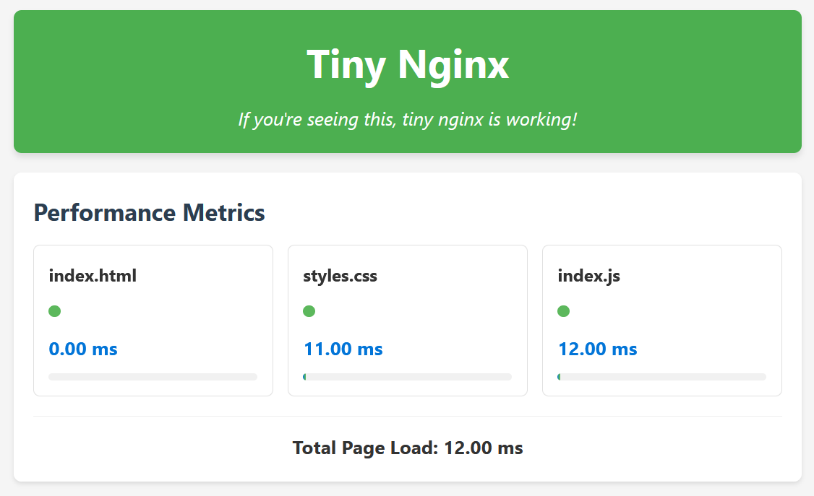
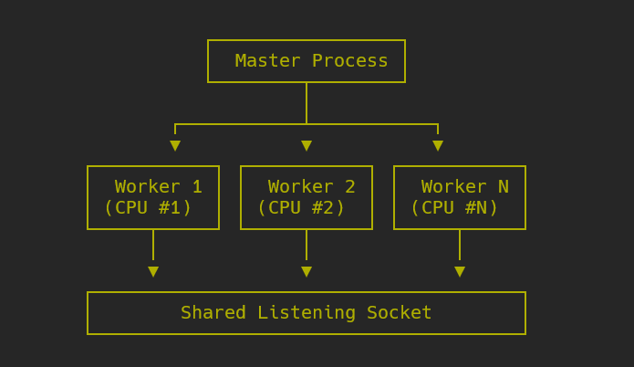

[](https://github.com/gd-arnold/tiny-nginx)

A lightweight, non-blocking, event-driven, multi-process HTTP server written in C, inspired by the core architecture of Nginx.



## Overview

`tiny-nginx` is a minimalistic HTTP server that implements the core architectural patterns that make Nginx powerful and efficient:

- **Non-blocking I/O**: Uses `epoll` in level-triggered mode for efficient I/O multiplexing
- **Event-driven architecture**: Handles connections asynchronously to maximize throughput
- **Multi-process model**: Creates worker processes equal to the number of CPU cores for optimal resource utilization

## Features

- **Asynchronous I/O**: Non-blocking sockets with epoll event handling
- **Efficient worker processes**: Automatically spawns workers based on available CPU cores
- **CPU affinity**: Each worker is bound to a specific CPU core
- **Static file serving**: Efficiently serves static files from a configured directory
- **HTTP protocol support**: Basic HTTP/1.1 implementation
- **Graceful shutdown**: Properly handles termination signals
- **MIME type detection**: Automatically sets appropriate Content-Type headers
- **URL decoding**: Properly handles URL-encoded paths
- **TCP optimizations**: Uses TCP_NODELAY to reduce latency

## Architecture


The server uses a multi-process architecture:

1. **Master Process**: Responsible for:
   - Initializing the listening socket
   - Spawning worker processes
   - Managing worker lifecycle
   - Handling shutdown signals

2. **Worker Processes**: Each worker:
   - Is bound to a specific CPU core
   - Accepts connections from the shared listening socket
   - Handles HTTP requests asynchronously
   - Serves static files efficiently using sendfile

3. **Event System**: Core of the non-blocking architecture:
   - Uses epoll (level-triggered mode) for efficient I/O multiplexing
   - Tracks connection states
   - Handles events from multiple file descriptors

## Building

> **Note:** This project only works on Linux systems as it relies on Linux-specific features like `epoll`.

```bash
# Clone the repository
git clone https://github.com/gd-arnold/tiny-nginx.git
cd tiny-nginx

# Build the project
make
```

## Usage

```bash
# Start the server on port 8080
./build/tiny-nginx -p 8080
```

By default the server serves files from the `./public` directory.

## Project Structure

- **client.{c,h}**: HTTP client connection handling
- **dbg.h**: Debugging macros
- **event.{c,h}**: Event system (epoll wrapper)
- **main.c**: Entry point
- **master.{c,h}**: Master process implementation
- **server.{c,h}**: TCP server setup
- **worker.{c,h}**: Worker process implementation

## Implementation Details

### Event Loop

The core of tiny-nginx is its event loop, which efficiently multiplexes I/O operations:

```c
while (running) {
    int nready = es_wait(es);
    
    for (size_t i = 0; i < (size_t)nready; i++) {
        EventBase* event_data = (EventBase*) es->events[i].data.ptr;
        uint32_t events = es->events[i].events;
        
        switch (event_data->type) {
            case SIGNAL_EVENT:
                running = false;
                break;
            case SERVER_EVENT:
                accept_client(es, (TCPServer*) event_data);
                break;
            case CLIENT_EVENT:
                if (events & EPOLLIN) {
                    receive_from_client(es, (HTTPClient*) event_data);
                } else if (events & EPOLLOUT) {
                    send_to_client(es, (HTTPClient*) event_data);
                }
                break;
        }
    }
}
```

### HTTP Request Processing

Each HTTP request follows a state machine approach:

1. **CLIENT_RECEIVING_REQUEST**: Read and parse the HTTP request
2. **CLIENT_SENDING_HEADERS**: Send HTTP response headers
3. **CLIENT_SENDING_FILE**: Send the requested file using sendfile
4. **CLIENT_CLOSING**: Close the connection

### File Serving

The server efficiently serves static files using `sendfile()` to avoid unnecessary copying between kernel and user space:

```c
ssize_t n = sendfile(client->event.fd, client->file_fd,
        &client->file_offset,
        client->file_size - client->file_offset);
```

## Limitations

The server is designed as a learning tool and is NOT meant to be used in production

There are many areas where it can be improved like:

- Client timeout handling (!)
- Detached mode
- Logging
- HTTP keep-alive support
- Configuration file

**🔗 [View the complete source code on GitHub](https://github.com/gd-arnold/tiny-nginx)**
